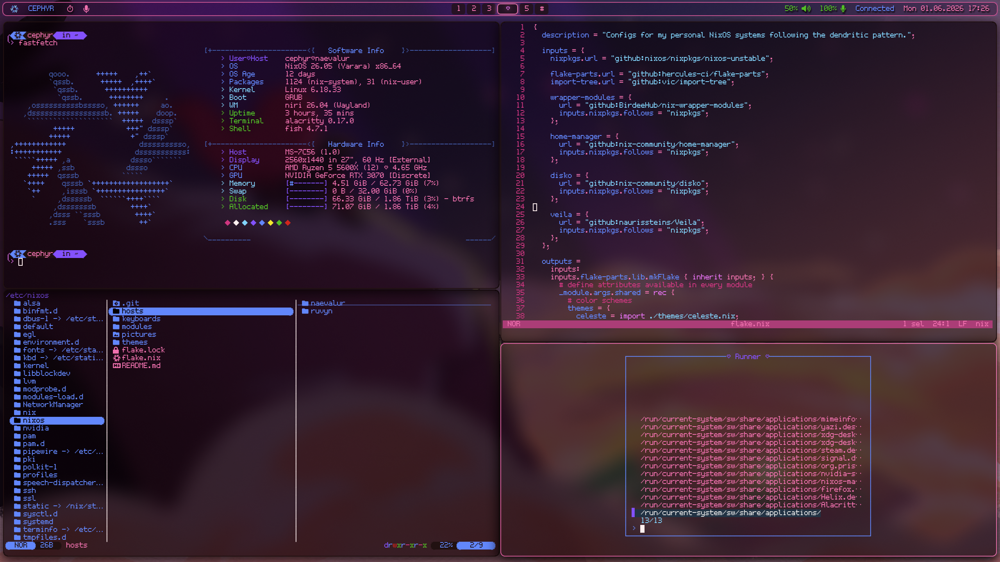
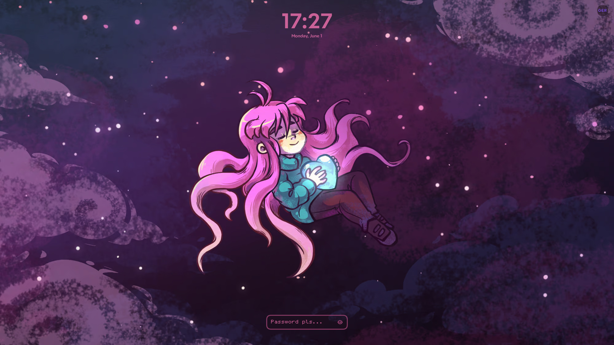

# Personal NixOS setup
My minimal, ergonomic setup for everyday use.

**Warning!** This is a personal project, I might make undocumented breaking changes at any time and offer no support.




Using:
- `NixOs` operating system
- `Niri` Wayland compositor
- `Waybar` status bar
- `Veila` lockscreen
- `Alacritty` terminal emulator
- `Fish` shell
- `Helix` text editor
- `Yazi` file manager
- `Fzf` launcher

## Architecture
This NixOS config uses `flake-parts` and `import-tree` to automatically construct the flake from every .nix file in [hosts](hosts) and [modules](modules).
Files within those directories that should not be treated as modules must start with '_', for example files that only serve to split a module for readability.

`disko` is used for declerative disk layout.

Packages are wrapped with their config using `wrapper-modules` whenever possible to confine the configuration to the nix store,
allowing deployment of configured packages on other machines without interfering with local configurations.

`Home Manager` is currently used to set the GTK theme and XDG user dirs as it was the only reliable way to do that, it will be removed once I find a different solution.

### Modules
Modules have a directory in [modules](modules), where every module inside contributes to a module with the directories name.
Settings and programs with similar use cases, that will never need to be split, are grouped in one module to reduce clutter.

- [base](modules/base) a collection of the most vital packages and settings, intended to be included in every system.
- [terminal](modules/terminal) a collection of terminal utils and programs needed for a terminal environment.
- [desktop](modules/desktop) a collection of programs for the desktop environment, like `niri`, `waybar`, `firefox`, `signal` and `veila`.
- [steam](modules/steam) enable the Steam option.
- [minecraft](modules/minecraft) install the Prism Launcher for Minecraft.
- [home-manager](modules/home-manager) temporary solution to set GTK theme and XDG user dirs, will be replaced eventually.

### Hosts
Each host machine has a directory in [hosts](hosts), with three files:
- disko.nix, that defines the file system as a module with name '\<host>-disko'
- hardware.nix, that defines hardware specific settings, like bootloader and firmware as a module with name '\<host>-hardware'
- default.nix, that includes the two previous modules, sets `theme` and `keyboard` options and defines which modules to include.

Two hosts exist currently, with non-descriptive names to avoid misleading names, should their purpose ever change:
- Naevalur, a desktop pc
- Ruvyn, a laptop

### Disk Layout
All configs use a LUKS container with a btrfs filesystem and subvolumes managed by btrfs.
This allows easy backups of user data with btrfs snapshots of home.
Snapshots outside of home serve no purpose, as NixOS generations already allow reverting system configurations.

### Secrets
NixOS has some solutions for declarative secret management, but none are used here as they might still pose a potential threat.
Instead, all secrets are managed imperatively.

### Keybinds
A lot of keybinds are positional, specifically the vim-style movement keys (hjkl on qwerty) and system commands like application launcher.
Two different layouts are supported defined in([keyboards](keyboards)):
- "colemak", designed to make sense with a Colemak layout, specifically my [custom keymap](https://github.com/cephyr-games/cephyr-keyboards) for my Aurora Sofle keyboard.
- "qwerty",  for Qwerty and Qwertz layouts, in case I don't have my fancy keyboard with me.
You can add more by importing them in the [Flake](flake.nix).
The layout is picked with
```nix
config.style.keyboard = "colemak";
```

### Colorscheme
Colors are defined in theme sets, the system can pick one with an option.
Currently only one theme exists, defined in [themes](themes).
You can add more by importing them in [flake.nix](flake.nix).
The theme is picked with
```nix
config.style.theme = "celeste";
```

### Wallpapers
Desktop, Backdrop and Lockscreen use artworks by Amora Bettany from the game *Celeste*,
freely available on the artists page [here](https://amora.ink/).

## Installation
Follow the official [NixOS manual](https://nixos.org/manual/nixos/stable/#ch-installation) (minimal ISO image, manual installation) up the section 'networking'.
Once you are booted into the image, and have a terminal with internet connection, follow these installation steps instead:
- Run `lsblk` to verify the name of the block device you want to install to (device, not partition!).
- Run `nix --extra-experimental-features 'nix-command flakes' run 'github:nix-community/disko/latest#disko-install' -- --write-efi-boot-entries --flake <flake> --mode format --disk main <device>` to install the configuration.
  - \<flake>: the flake defining your NixOS config and its name, e.g. github:cephyr-games/nixos-config#ruvyn
  - \<device>: the block device that will be **irreversibly overwritten** with the new NixOS system, e.g. /dev/nvme0n1
  - Omit '--write-efi-boot-entries' if the bootloader of NixOS should not have an efi boot entry, for example to instead chainload it from another bootloader.
  - You will be prompted for the LUKS passphrase by the installer.
  - Your entire NixOS config will be evaluated into /nix/store before installation can start.
    Since this directory lives in a tmpfs, installation may fail if you have insufficient RAM for that.
    In this case, either remove non-vital modules and pull them in after the system is installed, after which /nix/store will no longer live in RAM;
    or copy /nix/store onto an external drive (/nix/store is not empty, it contains all the tools of the install image) and mount that in the place of /nix/store.
- Run `passwd` to set the root password. **You will not be able to login without a password!**
- Run `passwd <user>` for every user to also set their passwords.
- Reboot into your new system.

## Config management
Installation does not clone the repository, this must be done manually.
The fish abbreviations defined in the config assume that the repo is located at /etc/nixos and is owned by root.
- `nixos-edit`   open helix with sudo at the repo root.
- `nixos-test`   rebuild the config without adding a boot entry. Note that the device name needs to match the nixos config name.
- `nixos-switch` rebuild the config and add a boot entry. Note that the device name needs to match the nixos config name.
- `nixos-status` run git status as sudo on the repo root.
- `nixos-add`    run git add as sudo on the repo root.
- `nixos-commit` run git commit as sudo on the repo root.

## Acknowledgement
Some configuration is based on [these dotfiles](https://github.com/Atrejooo/arch_dotfiles/tree/main), although it has been heavily modified and adapted for wrapper modules.
